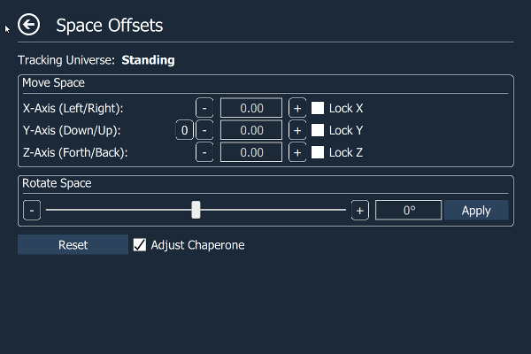

 
 

 > * [Features](#features)
 > * [Usage](#usage)
 >   * [Installer](#installer)
 >   * [Standalone](#standalone)
 >   * [Bindings](#bindings)
 >   * [Command Line Arguments](#command_line_arguments)
 >   * [Logging Config](#logging_config)
 >   * [Preview Builds](#preview_builds)
 > * [Documentation](#documentation)
 >   * [Top Page](#top_page)
 >   * [SteamVR Page](#steamvr_page)
 >   * [Chaperone Page](#chaperone_page)
 >   * [Chaperone Proximity Warning Settings Page](#chaperone_proximity_page)
 >   * [Play Space Page](#play_space_page)
 >   * [Playspace Fix Page](#playspace_fix_page)
 >   * [Audio Page](#audio_page)
 >   * [Revive Page](#revive_page)
 >   * [Utilities Page](#utilities_page)
 >   * [Statistics Page](#statistics_page)
 >   * [Settings Page](#settings_page)
 > * [How To Compile](#how_to_compile)
 >   * [Building on Windows](#building_on_windows)
 >   * [Building on Linux](#building_on_linux)
 > * [Notes](#notes)
 > * [License](#license)

# OpenVR Advanced Settings Overlay

Adds an overlay to the OpenVR dashboard that allows access to advanced settings.

# Features

- Set supersampling values.
- Enable/disable motion smoothing and advanced supersample filtering.
- Save supersampling and reprojection settings into profiles.
- Change several chaperone settings not accessible via SteamVR settings (to e.g. make it completely invisible).
- Chaperone Proximity Warning: Several warning methods can be configured.
- Chaperone Profiles: Allows to quickly switch chaperone geometry and settings while in VR.
- Temporarily move and rotate the playspace.
- Floor height fix.
- Displays several performance statistics and other statistics (e.g. headset rotations).
- Select the playback/mirror/recording audio device
- Mute/unmute and set volume of audio mirror device.
- Mute/unmute and set volume of microphone device.
- Implements push-to-talk and allows to configure push-to-talk profiles.
- Desktop mode shows a window on the desktop instead of a VR overlay.
- Revive settings support (Requires [Revive 1.0.4+](https://github.com/LibreVR/Revive) for full functionality).
- VR Keyboard Input Utilities
- Simple Alarm Clock
- Player height adjust toggle (Credits to mklim)

# Usage

## Installer

Download the newest installer from the [release section](https://github.com/OpenVR-Advanced-Settings/OpenVR-AdvancedSettings/releases) and execute it.

If you have an older standalone version installed, the installer will automatically uninstall the old version and install the new version.

## Standalone

Download the newest standalone archive from the [release section](https://github.com/OpenVR-Advanced-Settings/OpenVR-AdvancedSettings/releases) and unpack the archive.

To install for the first time simply start AdvancedSettings.exe once while SteamVR is running. It will register with SteamVR and automatically starts whenever SteamVR starts (Can be disabled in the settings).

To upgrade an existing installation first stop SteamVR and delete the old application folder (or override it). Then start SteamVR and run AdvancedSettings.exe once.

## Bindings

Advanced Settings supports the OpenVR IVRInput API. In order to make the bindings interface visible, change the `matzman666.AdvancedSettings.vrappconfig` in `C:\Program Files (x86)\Steam\config\vrappconfig` to have a `last_launch_time` close to the current date (in [Unix time](https://en.wikipedia.org/wiki/Unix_time)). If in doubt, try using the value from [this](https://time.is/Unix_time_now) site. Running the application normally will now make it show up in the bindings interface.

Alternatively, if the above doesn't work, run the `bindingsinterface.bat` file from the install directory. After you're done configuring your bindings, close SteamVR and start it up again. You are now using your new bindings. Advanced Settings will not show up in the bindings menu unless you're actively running the application with `bindingsinterface.bat`. Advanced Settings will not work normally while running with `bindingsinterface.bat`.

The above two solutions are workarounds to a bug in the OpenVR API.

After doing one of the above workarounds, when SteamVR starts click the menu -> Settings -> Controller Binding. You can also visit [this](127.0.0.1:8998/dashboard/controllerbinding.html) site in your internet browser. It's the same as the built in SteamVR bindings menu. SteamVR must be running for it to work.

By default no buttons are bound.

The following actions currently exist:

|    Action     |     Type      |  Explanation  |
| ------------- | ------------- |  ------------ |
| NextSong      | Binary/Button | The same as using the media keys. Tells a media player to play the next song.|
| PreviousSong  | Binary/Button | The same as using the media keys. Tells a media player to play the previous song. |
| pausePlaySong | Binary/Button | The same as using the media keys. Tells the media player to press play/pause. |
| stopSong      | Binary/Button | The same as using the media keys. Tells the media player to stop playback. |

## Command Line Arguments

The application (`AdvancedSettings.exe`) can be run with the following optional arguments:

`"-desktop"`: Creates a settings window on the desktop, but not in VR. Running `startdesktopmode.bat` in the install directory has the same effect.

`"-nosound"`: Forces sound effects off.

`"-nomanifest"`: Forces not using a `.vrmanifest`.

`"-installmanifest"`: Force installs the `.vrmanifest` and adds the application to autostart. If you're having issues with autostart not working try running the program once with this set. The program will exit early when this flag is set.

`"-removemanifest"`: Force uninstalls the `.vrmanifest`. This should be done every time the application is uninstalled. On Windows it is automatically done by the uninstaller. The program will exit early when this flag is set.

`"-bindingsinterface"`: Makes Advanced Settings show up in the SteamVR bindings interface. This is necessary for binding keys to actions. This is the same as running `bindingsinterface.bat` from the executable directory. The program will not exit when this is set. No normal functionality is available except using the bindings interface. Bindings set with this active will be available when this isn't active.

In addition, the application can receive the command line arguments from the [Easylogging++ library](https://github.com/zuhd-org/easyloggingpp#application-arguments).

## Logging Config

The logging output of the [Easylogging++ library](https://github.com/zuhd-org/easyloggingpp#application-arguments) can be customized by placing a file called `logging.conf` in the directory of the binary. This should be considered for advanced users only and it is not recommended.

## Preview builds

If you want to try latest and greatest unreleased features, you can download latest from the CI (Continuous Integration) server for [Windows](https://ci.appveyor.com/project/icewind1991/openvr-advancedsettings/branch/master). The Linux CI does not provide binary artifacts.

These version are not stable and this should be considered for advanced users only.

# Documentation

## Top Page:

- **Supersampling Profile**: Allows to apply supersampling profiles. Profiles can be created on the SteamVR page
- **Chaperone Profile**: Allows to apply chaperone profiles. Profiles can be created on the Chaperone page
- **Microphone**: Allows to set the microphone volume and to mute/unmute it.
- **Push-to-Talk**: Enable/disable push-to-talk.

## - SteamVR Page:

- **Profile**: Allows to apply/define/delete supersampling profiles that save supersampling and reprojection settings.
- **Application Supersampling**: Supersampling setting for OpenVR applications/games. Application supersampling [now behaves linearly](https://steamcommunity.com/games/250820/announcements/detail/1256913672017664045) where 2.0 means twice the number of pixel.
  - **Note**: Manual Supersampling Override be checked.
- **Enable Manual Supersampling Override**: Enables user control of Supersampling, instead of SteamVR auto profiles.
- **Enable Motion Smoothing**: Enables Motion Smoothing, and disables asynchronous reprojection.
- **Restart SteamVR**: Restart SteamVR (May crash the Steam overlay when SteamVR Home is running when you restart. Therefore I advice that you close SteamVR Home before restarting).

## - Chaperone Page:

- **Profile**: Allows to apply/define/delete chaperone profiles that save geometry info, style info or other chaperone settings (What exactly is saved in a chaperone profile can be selected when a profile is created).
- **Visibility**: Allows to configure the visibility of the chaperone bounds. Unlike the slider in the chaperone settings, this one is not capped at 30%. When set to 0 chaperone bounds are completely invisible.
- **Fade Distance**: Allows to configure the distance at which the chaperone bounds are shown. When set to 0 chaperone bounds are completely invisible.
- **Height**: Allows to configure the height of the chaperone bounds.
- **Center Marker**: Displays a marker that represents the center of the playspace.
- **Play Space Maker**: Displays the outlines of the rectangle representing the playspace.
- **Force Bounds**: Force chaperone bounds always on.
- **Proximity Warning Settings**: Opens a page that allows to configure several warning methods for when the user comes too close to the chaperone bounds.
- **Flip Orientation**: Flips the orientation of the play space.
- **Reload from Disk**: Reloads the chaperone bounds geometry from disk.

## - Chaperone Proximity Warning Settings Page:

- **Switch to Beginner Mode**: Switches the chaperone bound's style to beginner mode when the user's distance to the chaperone falls below the configured activation distance.
- **Trigger Haptic Feedback**: The left and right controller start vibrating when the user's distance to the chaperone falls below the configured activation distance.
- **Audio Warning**: Plays an alarm sound when the user's distance to the chaperone falls below the configured activation distance.
  - **Loop Audio**: Whether the audio alarm should only be played once or in a loop.
  - **Loop Audio**: Modify audio volume as a function of the user's distance to the chaperone.
- **Open dashboard**: Opens the dashboard when the user's distance to the chaperone falls below the configured activation distance. The idea is to pause the game (most single-player games auto-pause when the dashboard is shown) to give the user time for reorientation.
- **Velocity Dependent Fade/Activation Distance**: Dynamically modifies the chaperone's fade distance and the proximity warning's activation distance as a function of the player's speed. The used formula is: *distance = old_distance * ( 1 + distance_modifier * max(left_controller_speed, right_controller_speed, hmd_speed) )*

## - Play Space Page:

Allows to temporarily move and rotate the center of the playspace. This allows to reach interaction elements that are just inside our real-world walls or otherwise inaccessible (e.g. when your playspace is smaller than the recommended one). Can also be used to discover the terrors that lie outside of the intended playspace (ever wondered what's behind the door in The Lab?).

- **Virtual Move Shortcut**: Allows moving the placespace center by holding down the application menu shortcut and moving the controller.
- **Adjust Chaperone**: When enabled then the chaperone bounds stay in place when the playspace is moved or rotated (so noone gets hurt). Unfortunately this does not work when moving up/down.

## - Playspace Fix Page:

- **Fix Floor** Allows you to fix the height of your floor. Just place one controller on your floor and press the button.
- **Recenter Playspace** Besides fixing the floor height, also recenters the place space around the controller on the floor.

## - Audio Page:

- **Playback Device**: Allows to select the playback device.
- **Mirror Device**: Allows to select the mirror device, set its volume and to mute/unmute it.
- **Microphone**: Allows to select the microphone device, set its volume and to mute/unmute it.
- **Proximity Sensor Mutes/Unmutes Microphone**: Allows the proximity sensor to mute the microphone when the user is not wearing the HMD, and to unmute it when the user is wearing the HMD.
- **Push-to-Talk**: Enable/disable push-to-talk. When push-to-talk is activated the microphone gets muted unless the Push To Talk action is activated.
- **Show Notification**: Shows a notification icon in the headset when the Push To Talk action is activated.
- **Push-to-Mute**: Inverse push-to-talk. The Microphone is unmuted by default and muted when any of the configured buttons is pressed.
- **Audio Profile**: Allows you to apply/define/delete audio profiles that save playback devices, mute state, and volume.

## - Revive Page:

**The Revive page is not currently being maintained. Features may not be stable, performant or actually work.**

The Revive page is only visible when the [Revive overlay](https://github.com/LibreVR/Revive) is installed. In case an installed Revive overlay is not correctly detected you can force the Revive page in the settings.

Any changes to controller settings are immediately applied by Revive (Requires Revive 1.0.4+).

- **Render Target Override**: Overrides the Oculus-side render target (aka supersampling). Enabling it prevents Oculus applications from dynamically modifying this value. Warning: Is applied on top of the SteamVR supersampling value. (pixelsPerDisplayPixel setting in the vrsettings file)
- **Grip Button mode**: Allows to set the grip button mode. (ToggleGrip setting in the vrsettings file)
- **Toggle Delay**: Allows to configure the toggle delay. (ToggleDelay setting in the vrsettings file)
- **Trigger As Grip**:  Swaps the trigger and grip. (TriggerAsGrip setting in the vrsettings file)
- **Deadzone**: Allows to modify the simulated thumbsticks' deadzone. (ThumbDeadzone setting in the vrsettings file)
- **Sensitivity**: Allows to modify the simulated thumbsticks' sensitivity. (ThumbSensitivity setting the vrsettings file)
- **Yaw**: Allows to modify the touch controllers yaw orientation. (TouchYaw setting the vrsettings file)
- **Pitch**: Allows to modify the touch controllers pitch orientation. (TouchPitch setting the vrsettings file)
- **Roll**: Allows to modify the touch controllers roll orientation. (TouchRoll setting the vrsettings file)
- **X**: Allows to modify the touch controllers x-offset. (TouchX setting the vrsettings file)
- **Y**: Allows to modify the touch controllers y-offset. (TouchY setting the vrsettings file)
- **Z**: Allows to modify the touch controllers z-offset. (TouchZ setting the vrsettings file)
- **Controller Profile**: Allows to apply/define/delete controller profiles that save the controller settings (grip button mode, deadzone, sensitivity, pitch/yaw/roll and x/y/z-offsets).

## - Utilities Page:

- **Keyboard Utilities:** Some applications (mostly 2D-monitor applications with tackled-on/modded-in VR support) do not support the VR keyboard but require an actual physical keyboard for text input. This utilities allow to send emulated key strokes from VR keyboard input to such application to overcome this limitation. Does not work in desktop mode.

- **Alarm Clock:** Just a simple alarm clock so you don't miss important appointments. VR can sure mess up perception of time. Does not work in desktop mode.

- **Steam Desktop Overlay Width:** Allows to increase the size of the Steam desktop overlay. Useful for multi-monitor setups.

- **Media Control Keys:** Allows controlling a media player through the media keys. This is the same as having a keyboard with media keys and then pressing them. Should support most common media players.

## - Statistics Page:

- **HMD Distance Moved**: Shows the distance the headset has moved on the xz-plane.
- **HMD Rotations**: Shows the number of rotations around the y-axis (Useful for untangling the cord).
- **Left Controller Max Speed**: Shows the max speed of the left controller.
- **Right Controller Max Speed**: Shows the max speed of the right controller.
- **Presented Frames**: Number of frames presented to the hmd in the currently running application.
- **Dropped Frames**: Number of frames dropped in the currently running application.
- **Reprojected Frames**: Number of frames reprojected in the currently running application.
- **Timed Out**: Number of times the currently running application timed out.
- **Reprojection Ratio**: Ratio of presented frames to reprojected frames.

## - Settings Page:

- **Autostart:** Allows you to enable/disable auto start.
- **Force Revive Page:** Force the Revive page button on the root page to be visible.

# How to Compile

## Building on Windows

Full build instructions can be found [here](docs/building_for_windows.md).

## Building on Linux

Full build instructions can be found [here](docs/building_for_linux.md).

# Notes:

- The center marker and the play space marker are provided by the chaperone subsystem, and therefore they will have the same color and visibility settings as the chaperone bounds.

- Application autostart can also be configured in the SteamVR menu (SteamVR->Settings->Applications->"Advanced Settings").

- You can modify the shutdown wait time when restarting SteamVR by opening restartvrserver.bat and changing the number behind "timeout /t" (unit is seconds).

# License

This software is released under GPL 3.0.
