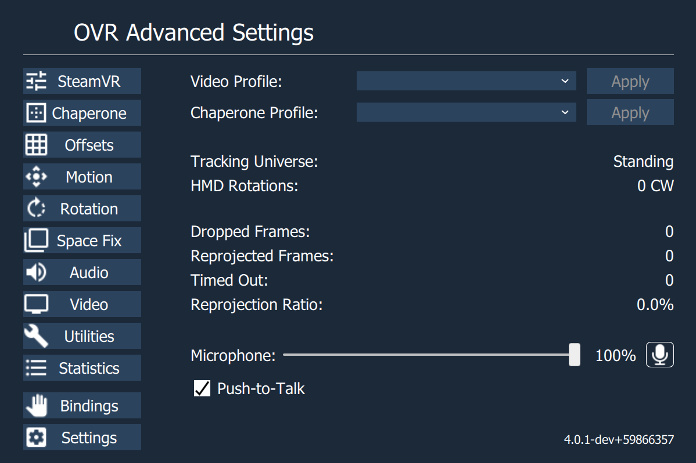
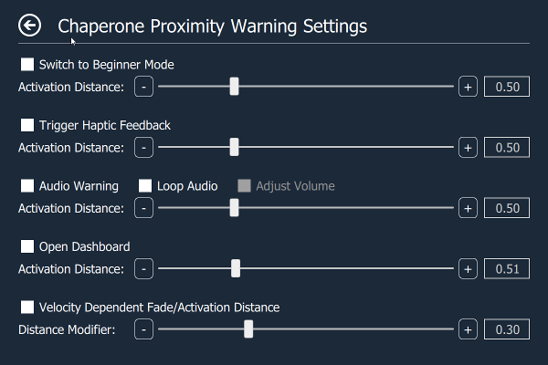
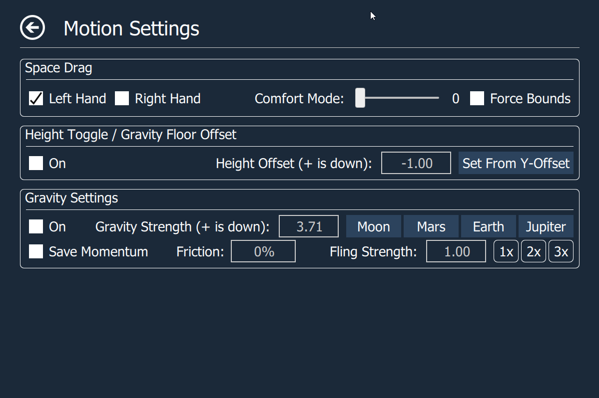

 

 

# OpenVR Advanced Settings Overlay
Adds an overlay to the OpenVR dashboard that allows access to advanced settings and useful utilities.

- [Features](#features)
- [Usage](#usage)
  * [Installer](#installer)
  * [Standalone](#standalone)
  * [Bindings](#bindings)
    + [Music](#music)
    + [Motion](#motion)
    + [Misc.](#misc)
    + [Haptics.](#haptics)
  * [Default Bindings](#default-bindings)
    + [Vive Wands](#vive-wands)
    + [Knuckles](#knuckles)
    + [Other Controllers](#other-controllers)
  * [SteamVR Input Guide](#steamvr-input-guide)
  * [Command Line Arguments](#command-line-arguments)
  * [Preview builds](#preview-builds)
- [Documentation](#documentation)
  * [Top Page](#top-page)
  * [- SteamVR Page](#--steamvr-page)
  * [- Chaperone Page](#--chaperone-page)
  * [- Chaperone Proximity Warning Settings Page](#--chaperone-proximity-warning-settings-page)
  * [- Space Offset Page](#--space-offset-page)
  * [- Motion Page](#--motion-page)
  * [- Space Fix Page](#--space-fix-page)
  * [- Audio Page](#--audio-page)
  * [- Video Page](#--video-page)
  * [- Utilities Page](#--utilities-page)
  * [- Desktop Overlay Page](#--desktop-overlay-page)
  * [- Statistics Page](#--statistics-page)
  * [- Settings Page](#--settings-page)
- [How to Compile](#how-to-compile)
  * [Building on Windows](#building-on-windows)
  * [Building on Linux](#building-on-linux)
- [Notes:](#notes-)
- [Common Issues](#common-issues)
- [License](#license)

# Features

Do all this without leaving VR:

- Set supersampling values.
- Enable/disable motion smoothing and advanced supersample filtering.
- Save supersampling and reprojection settings into profiles.
- Change several chaperone settings not accessible via SteamVR settings (to e.g. make it completely invisible).
- Chaperone Proximity Warning: Several warning methods can be configured.
- Chaperone Profiles: Allows to quickly switch chaperone geometry and settings while in VR.
- Temporarily move and rotate the playspace.
- Floor height fix, for knuckles and wands.
- Floor Center fix.
- Display several performance statistics and other statistics (e.g. headset rotations).
- Control audio devices, volumes and mirror devices.
- Control microphone as push-to-talk or push-to-mute via VR controller button.
- Simple Alarm Clock
- Player height adjust toggle
- Snap Turn option.
- Advanced Space Features: gravity, space-turn, and space-drag
- Control media players (Pause/Play, Next Song, Previous Song, Stop).
- Send keyboard inputs (like Alt+Tab, Alt+Enter, Backspace, etc.).
- Bind VR controller buttons to send keyboard inputs (for example to mute VOIP applications while in VR). [Tutorial](docs/keyboard_input_guide.md).
- All the above also available from a window on the desktop.

# Usage

## Installer

Download the newest installer from the [release section](https://github.com/OpenVR-Advanced-Settings/OpenVR-AdvancedSettings/releases) and execute it.

If you have an older standalone version installed, the installer will automatically uninstall the old version and install the new version.

## Standalone

Download the newest standalone archive from the [release section](https://github.com/OpenVR-Advanced-Settings/OpenVR-AdvancedSettings/releases) and unpack the archive.

To install for the first time simply start AdvancedSettings.exe once while SteamVR is running. It will register with SteamVR and automatically starts whenever SteamVR starts (Can be disabled in the settings).

To upgrade an existing installation first stop SteamVR and delete the old application folder (or override it). Then start SteamVR and run AdvancedSettings.exe once.

## Bindings

For information on how to properly set-up bindings see: [SteamVR Input Guide](#steamvr-input-guide)

The following actions currently exist:
### Music

Actions associated with media player.

|    Action     |     Type      |  Explanation  |
| ------------- | ------------- |  ------------ |
| Play Next Track | Binary/Button | The same as using the media keys. Tells a media player to play the next song.|
| Play Previous Track | Binary/Button | The same as using the media keys. Tells a media player to play the previous song. |
| Pause/Play Track | Binary/Button | The same as using the media keys. Tells the media player to press play/pause. |
| Stop Track| Binary/Button | The same as using the media keys. Tells the media player to stop playback. |

### Motion

Actions associated with motion tab, and motion.

Override actions will take priority over non-override actions during simultaneous activation. Example: binding space turn to single click and space drag (override) to double click on the same physical button.

|    Action     |     Type      |  Explanation  |
| ------------- | ------------- |  ------------ |
| Left Hand Space Turn | Binary/Button | Rotates PlaySpace based on left controller rotation while held. |
| Right Hand Space Turn | Binary/Button | Rotates PlaySpace based on right controller rotation while held. |
| Left Hand Space Drag | Binary/Button | Moves PlaySpace based on left controller position while held. |
| Right Hand Space Drag | Binary/Button | Moves PlaySpace based on right controller position while held. |
| (Optional Override) Left Hand Space Turn | Binary/Button | Override version: will activate instead of non-override during simultaneous activation. |
| (Optional Override) Right Hand Space Turn | Binary/Button | Override version: will activate instead of non-override during simultaneous activation. |
| (Optional Override) Left Hand Space Drag | Binary/Button | Override version: will activate instead of non-override during simultaneous activation. |
| (Optional Override) Right Hand Space Drag | Binary/Button | Override version: will activate instead of non-override during simultaneous activation. |
| Swap Active Space Drag to Left Hand (Override) | Binary/Button |  Activates space drag on left controller only if right controller is currently active in space drag. (Useful for climbing motions) |
| Swap Active Space Drag to Right Hand (Override) | Binary/Button | Activates space drag on right controller only if left controller is currently active in space drag. (Useful for climbing motions) |
| Gravity Toggle | Binary/Button |  Toggles Gravity state when pressed. |
| Gravity Reverse | Binary/Button |  Temporarily Reverses Gravity while held. |
| Reset Offsets | Binary/Button |  Resets your offset and rotation to 0. |
| Height Toggle | Binary/Button |  Shifts the gravity floor level by offset configured in motion tab. If gravity is inactive: also shifts the user's current y-axis position by offset configured in motion tab. |
| Snap-Turn Left | Binary/Button |  Rotates a set value to the left based on settings in motion tab. |
| Snap-Turn Right | Binary/Button |  Rotates a set value to the right based on settings in motion tab. |
| Smooth-Turn Right | Binary/Button | Rotates an amount per frame to the right based on settings in motion tab. |
| Smooth-Turn Left | Binary/Button | Rotates an amount per frame to the left based on settings in motion tab. |

### Misc.

Actions that don't have a clear category.

|    Action     |     Type      |  Explanation  |
| ------------- | ------------- |  ------------ |
| X-Axis Lock Toggle | Binary/Button | Toggles the lock of the X-Axis for offsets.|
| Y-Axis Lock Toggle | Binary/Button | Toggles the lock of the Y-Axis for offsets.|
| Z-Axis Lock Toggle | Binary/Button | Toggles the lock of the Z-Axis for offsets.|
| Chaperone Toggle | Binary/Button | Toggles the chaperone on/off. |
| Push to Talk | Binary/Button |  Acts as starter for PTT, can mute if push-to-mute is selected.|
| Keyboard Shortcut One | Binary/Button | Sends the key sequence defined the the settings file. Defaults to Ctrl+Shift+M (Discord default toggle mute). |
| Keyboard Shortcut Two | Binary/Button | Sends the key sequence defined the the settings file. This has no default sequence. |
| Keyboard Shortcut Three | Binary/Button | Sends the key sequence defined the the settings file. This has no default sequence. |

### Haptics.

Actions to be handled by the system.

|    Action     |     Type      |  Explanation  |
| ------------- | ------------- |  ------------ |
| Haptics Left | Vibration | Handle for haptic events on the Left Controller. |
| Haptics Right | Vibration | Handle for haptic events on the Right Controller. |
| Proximity Sensor | Binary/Button | Connects Automatically to your HMD's proximity sensor. **Do not "bind" this action**, it will cause un-predictable behavior. |

## Default Bindings

### Vive Wands

- Menu Button (both hands)
  - **Single Click**: Space Turn (respective hand)
  - **Double Click**: Space Drag (override) (respective hand)
  - **Single Click**: Swap Active Space Drag (override) (respective hand)
- TrackPad (right hand)
  - **D-pad Down click**: Push-to-Talk
- Haptics bound

### Valve Index Controllers (Knuckles)

- B Button (both hands)
  - **Single Click**: Space Turn (respective hand)
  - **Double Click**: Space Drag (override) (respective hand)
  - **Single Click**: Swap Active Space Drag (override) (respective hand)
- Trigger (left hand)
  - **Click**: Push-to-Talk
- Haptics boun

### WMR

- Menu Button (both hands)
  - **Single Click**: Space Turn (respective hand)
  - **Double Click**: Space Drag (override) (respective hand)
  - **Single Click**: Swap Active Space Drag (override) (respective hand)
- TrackPad (right hand)
  - **D-pad Down click**: Push-to-Talk
- Haptics bound

### Other Controllers

No current default bindings you will have to make your own.

## SteamVR Input Guide

A Guide to the SteamVR Input System can be found [here](docs/SteamVRInputGuide.md)

**Or** a Video guide by Kung can be found [here](https://youtu.be/2ZHdjOfnqOU)

## Command Line Arguments

The application (`AdvancedSettings.exe`) can be run with the following optional arguments:

`"--desktop-mode"`: Creates a settings window on the desktop, but not in VR. Running `startdesktopmode.bat` in the install directory has the same effect.

`"--force-no-sound"`: Forces sound effects off.

`"--force-no-manifest"`: Forces not using a `.vrmanifest`.

`"--force-install-manifest"`: Force installs the `.vrmanifest` and adds the application to autostart. If you're having issues with autostart not working try running the program once with this set. The program will exit early when this flag is set.

`"--force-remove-manifest"`: Force uninstalls the `.vrmanifest`. This should be done every time the application is uninstalled. On Windows it is automatically done by the uninstaller. The program will exit early when this flag is set.

## Preview builds

If you want to try latest and greatest unreleased features, you can download the latest from the CI (Continuous Integration) server for [Windows](https://ci.appveyor.com/project/icewind1991/openvr-advancedsettings/branch/master). The Linux CI does not provide binary artifacts.

These version are not stable and this should be considered for advanced users only.

# Documentation

## Top Page

- **Supersampling Profile**: Allows to apply supersampling profiles. Profiles can be created on the SteamVR page
- **Chaperone Profile**: Allows to apply chaperone profiles. Profiles can be created on the Chaperone page
- **Microphone**: Allows to set the microphone volume and to mute/unmute it.
- **Push-to-Talk**: Enable/disable push-to-talk.

## - SteamVR Page

- **Profile**: Allows to apply/define/delete supersampling profiles that save supersampling and reprojection settings.
- **Application Supersampling**: Supersampling setting for OpenVR applications/games. Application supersampling [now behaves linearly](https://steamcommunity.com/games/250820/announcements/detail/1256913672017664045) where 2.0 means twice the number of pixel.
  - **Note**: Manual Supersampling Override be checked.
  - **Note**: Some apps will require restarting for changes of Super-Sampling to take effect.
- **Enable Manual Supersampling Override**: Enables user control of Supersampling, instead of SteamVR auto profiles.
- **Enable Motion Smoothing**: Enables Motion Smoothing, and disables asynchronous reprojection.
- **Enable Timing Overlay**: Enables a simple Timing overlay, locked to HMD currently.
- **Restart SteamVR**: Restart SteamVR (May crash the Steam overlay when SteamVR Home is running when you restart. Therefore I advice that you close SteamVR Home before restarting).
## - Chaperone Page

- **Profile**: Allows to apply/define/delete chaperone profiles that save geometry info, style info or other chaperone settings (What exactly is saved in a chaperone profile can be selected when a profile is created).
- **Visibility**: Allows to configure the visibility of the chaperone bounds. 50% to 100% opacity.
- **Fade Distance**: Allows to configure the distance at which the chaperone bounds are shown. When set to 0 chaperone bounds are completely invisible.
- **Height**: Allows to configure the height of the chaperone bounds. **(Temporarily disabled pending integration into new motion system.)**
- **Center Marker**: Displays a marker that represents the center of the playspace.
- **Play Space Maker**: Displays the outlines of the rectangle representing the playspace.
- **Force Bounds**: Force chaperone bounds always on.
- **Disable Chaperone**: Disables Chaperone by setting fade distance to 0.0.
- **Proximity Warning Settings**: Opens a page that allows to configure several warning methods for when the user comes too close to the chaperone bounds.
- **Rotate Orientation**: Rotates the orientation by a set amount.
- **Reload from Disk**: Reloads the chaperone bounds geometry from disk.

## - Chaperone Proximity Warning Settings Page

- **Switch to Beginner Mode**: Switches the chaperone bound's style to beginner mode when the user's distance to the chaperone falls below the configured activation distance.
- **Trigger Haptic Feedback**: The left and right controller start vibrating when the user's distance to the chaperone falls below the configured activation distance. (HMD or controllers can trigger)
- **Audio Warning**: Plays an alarm sound when the user's distance to the chaperone falls below the configured activation distance.
  - **Loop Audio**: Whether the audio alarm should only be played once or in a loop.
  - **Loop Audio**: Modify audio volume as a function of the user's distance to the chaperone.
- **Open dashboard**: Opens the dashboard when the user's distance to the chaperone falls below the configured activation distance. The idea is to pause the game (most single-player games auto-pause when the dashboard is shown) to give the user time for reorientation.
- **Velocity Dependent Fade/Activation Distance**: Dynamically modifies the chaperone's fade distance and the proximity warning's activation distance as a function of the player's speed. The used formula is: *distance = old_distance * ( 1 + distance_modifier * max(left_controller_speed, right_controller_speed, hmd_speed) )*

## - Space Offset Page

Allows users to temporarily move and rotate the center of the playspace. This allows to reach interaction elements that are just outside our real-world walls or otherwise inaccessible (e.g. when your playspace is smaller than the recommended one). Can also be used to discover the terrors that lie outside of the intended playspace (ever wondered what's behind the door in The Lab?).

- **Adjust Chaperone**: When enabled, the chaperone bounds stay accurate even when the playspace is moved or rotated (so noone gets hurt). Depending on chaperone mode this may or may not adjust with height.
- **Seated Recenter**: When clicked, applies the current location and angle of the headset to the offsets such that the user is brought to a centered position. Also applies the current headset height to the default seated height (not visible in offsets). This action will also be activated automatically when a seated application sends a reset center command. *Note: This button is only visible when running seated applications.*

## - Motion Page

- **Space Drag**: Allows shifting your playspace by dragging your controller, Binds must be set via SteamVR Input system.
  - **Left/Right Hand**: Toggles functionality (must be active in addition to binding via input system to work.)
  - **Comfort Mode**: Limits the rate at which your movement updates, reducing smoothness so that perceived motion starts to feel more like mini-teleports. Higher values reduce smoothness more.
  - **Force Bounds**: Forces the display of the chaperone bounds during Space Drag.
- **Space Turn**: Allows rotating your playspace by rotating your controller. Binds must be set via SteamVR Input system.
  - **Left/Right Hand**: Toggles functionality (must be active in addition to binding via input system to work.)
  - **Comfort Mode**: Limits the rate at which your rotation updates, reducing smoothness so that perceived rotation starts to feel more like mini-snap-turns. Higher values reduce smoothness more.
  - **Force Bounds**: Forces the display of the chaperone bounds during Space Turn.
- **Height Toggle**: Toggle between zero and an offset for gravity floor height. If gravity is inactive the user is also moved to this offset. (Example: allows for quick switching between a seated and standing height.) Can be bound via SteamVr Input System.
  - **On**: Current toggle state, Binds directly modify this.
  - **Height Offset**: The amount of the offset (+ is down.)
  - **Set From Y-Offset**: grabs the Y-Offset value from Offset Page.
- **Gravity Settings**: Provides a gravity and momentum simulation to dynamically move your space offset.
  - **On**: Current toggle state, Binds directly modify this.
  - **Gravity Strength**: Gravity simulation's downward acceleration in meters per second squared. Planet buttons provide quick settings for well known gravity strengths. Values can also be typed in directly.
  - **Save Momentum**: whether your momentum is saved between on/off toggles of gravity.
  - **fling Strength**: adjusts the strength at which you "throw" yourself with space drag feature.
- **Snap Turn Angle**: Allows snap (instant) turning by the specified angle. Can type in values or use the preset buttons for angles that neatly divide 360 degrees. Must bind actions via SteamVR Input interface.
- **Smooth Turn Rate**: Allows smooth turning by a percentage of a degree per frame. (i.e. 100% at 90fps is 90 degress/sec or 15 RPM)

## - Space Fix Page

- **Fix Floor** Allows you to fix the height of your floor. Just place one controller on your floor and press the button.
- **Recenter Playspace** Besides fixing the floor height, also recenters the place space around the controller on the floor.
- **Undo Fix** Removes last "fix" **(Temporarily disabled pending integration into new motion system.)**
- **Apply Space Settings Offsets as Center** Takes current values from Offsets page and re-caliberates center/rotation. **Caution** The reset function will then refer to this location as the new zero location, overriding the old zero location.
  
## - Audio Page

- **Playback Device**: Allows to select the playback device.
- **Mirror Device**: Allows to select the mirror device, set its volume and to mute/unmute it.
- **Microphone**: Allows to select the microphone device, set its volume and to mute/unmute it.
- **Proximity Sensor Mutes/Unmutes Microphone**: Uses the HMD's proximity Sensor to mute the mic when it is removed from your head, PTT works with this feature, But you will be un-able to manually mute/un-mute your mic via icon.
- **Push-to-Talk**: Enable/disable push-to-talk. When push-to-talk is activated the microphone gets muted unless the Push To Talk action is activated.
- **Show Notification**: Shows a notification icon in the headset when the Push To Talk action is activated.
- **Push-to-Mute**: Inverse push-to-talk. The Microphone is unmuted by default and muted when the keybind is pressed.
  - **NOTE**: The Push-to-talk box must be enabled for this feature to work.
- **Audio Profile**: Allows you to apply/define/delete audio profiles that save playback devices, mute state, and volume.

## - Video Page

- **Brightness**: Allows Dimming of your view.
  - **On/Off**: Toggles The Dimming on/off.
  - **Brightness**: The amount of dimming.
  - **Note**: Does not necessarily reduce light output of HMD will vary based on panel type etc.
- **Color Adjustment**: Allows Adjusting of the Color of your display.
  - **On/Off**: Toggles adjustment on/off.
  - **Opacity**: The amount of color applied.
  - **Color Options**: Adjusts percentage of each of the respective colors.

## - Utilities Page

- **Keyboard Utilities:** Some applications (mostly 2D-monitor applications with tackled-on/modded-in VR support) do not support the VR keyboard but require an actual physical keyboard for text input. This utilities allow to send emulated key strokes from VR keyboard input to such application to overcome this limitation. Does not work in desktop mode. The "Keyboard Input" button works as described [here](docs/specs/Keyboard_Manager-Parser_Spec.md).

- **Alarm Clock:** Just a simple alarm clock so you don't miss important appointments. VR can sure mess up perception of time. Does not work in desktop mode.

- **Media Control Keys:** Allows controlling a media player through the media keys. This is the same as having a keyboard with media keys and then pressing them. Should support most common media players.

## - Desktop Overlay Page

- **Overlay Width:** The width of the overlay in meters. Multi screen setups need larger values to see any difference.

- **Up/Down Translation:** Moves the overlay up and down.

- **Forwards/Backwards Translation:** Moves the overlay forwards and backwards.

- **Left/Right Translation:** Moves the overlay left or right.

## - Statistics Page

- **HMD Distance Moved**: Shows the distance the headset has moved on the xz-plane.
- **HMD Rotations**: Shows the number of rotations around the y-axis (Useful for untangling the cord).
- **Left Controller Max Speed**: Shows the max speed of the left controller.
- **Right Controller Max Speed**: Shows the max speed of the right controller.
- **Presented Frames**: Number of frames presented to the hmd in the currently running application.
- **Dropped Frames**: Number of frames dropped in the currently running application.
- **Reprojected Frames**: Number of frames reprojected in the currently running application.
- **Timed Out**: Number of times the currently running application timed out.
- **Reprojection Ratio**: Ratio of presented frames to reprojected frames.

## - Settings Page

- **Autostart:** Allows you to enable/disable auto start.
- **Force Revive Page:** No Longer Supported Does Nothing.
- **Allow External App Chaperone Edits:** Incorporates changes to the chaperone and universe center made by other applications. These changes could come from anywhere, including apps with unpredictable interactions with Advanced Settings. Therefore, this option opens the potential for chaperone misalignment or corruption. However it also allows other chaperone tweaking tools to function in tandem with Advanced Settings. **This option should only be checked if required for compatibility with other apps.** *Note: Changes will only take effect when offsets and rotation are all zero.*
- **Old-Style Motion:** Uses the old system of writing the chaperone universe center and bounds to disk every frame. Use this option only if you experience issues with playspace motion such as snapping back to reset position after releasing a space-drag. This old mode is smooth on most systems but is in theory less performant than the normal method.
- **Universe-Centered Rotation:** Causes Rotation to be applied to Universe Center Rather than HMD (Disables offsets automatically compensating to pivot at the HMD).

# How to Compile

## Building on Windows

Full build instructions can be found [here](docs/building_for_windows.md).

## Building on Linux

Full build instructions can be found [here](docs/building_for_linux.md).

# Notes:

- The center marker and the play space marker are provided by the chaperone subsystem, and therefore they will have the same color and visibility settings as the chaperone bounds.

- Application autostart can also be configured in the SteamVR menu (SteamVR->Settings->Applications->"Advanced Settings").

- You can modify the shutdown wait time when restarting SteamVR by opening restartvrserver.bat and changing the number behind "timeout /t" (unit is seconds).

- When Using Proximity Sensor Features while the Dashboard is up the action will not evaluate, so your mic will be muted, and some chaperone warnings won't work while dashboard is up.

# Common Issues:

- **Issue:** Upon clicking ADV-Settings icon no page shows up.
  - **Cause:** related to multiple GPU systems (and specifically nvidia), and ALVR
  - **Solution:** go to Nvidia Control Panel -> manage 3D settings -> add Advanced Settings, and force the vr gpu for it.

- **Issue:** Snap back when using motion controls with WMR headset
  - **Cause:** WMR boundary off, or set up for standing only.
  - **Solution:** Please set-up WMR for all experiences, and then if you don't want WMR boundary you can toggle off the boundary **after** SteamVR/OpenVR has been started.

# License

This software is released under GPL 3.0.
