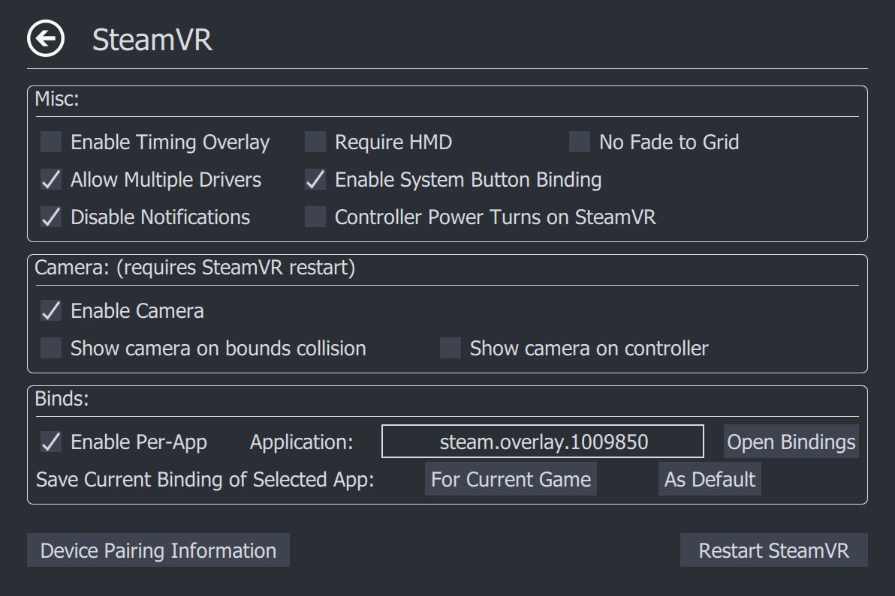
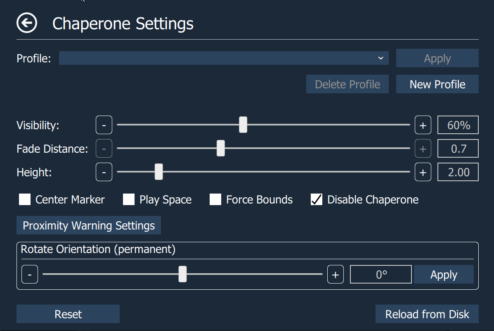
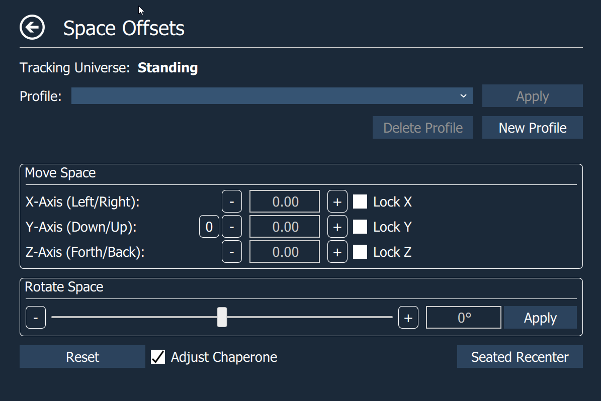
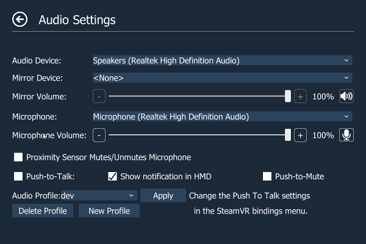
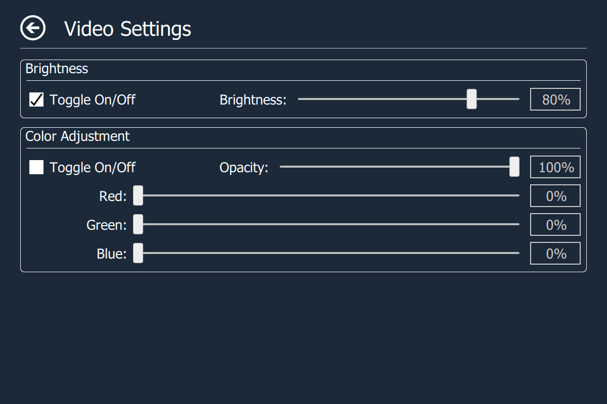
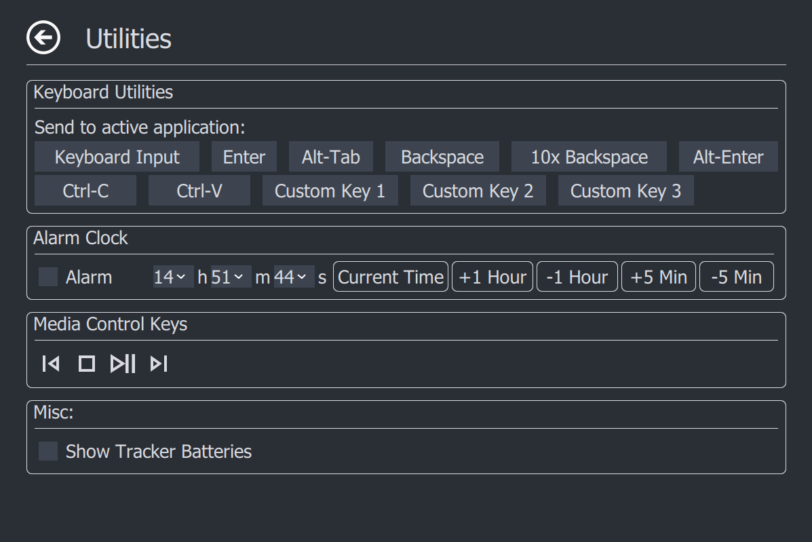
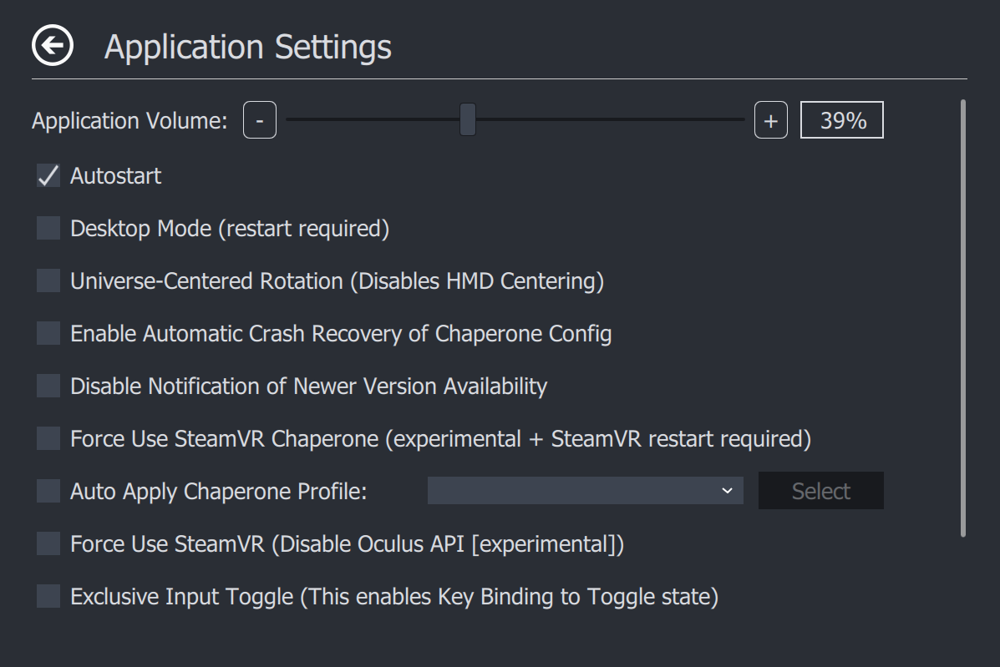

 

 

# OpenVR Advanced Settings Overlay
Adds an overlay to the OpenVR dashboard that allows access to advanced settings and useful utilities.

* [Features](#features)
* [Usage](#usage)
  * [Windows](#windows)
     * [Steam](#steam)
     * [Installer](#installer)
     * [Standalone](#standalone)
  * [Linux](#linux)
     * [Steam for Linux](#SteamLinux)
     * [AppImage](#appimage)
     * [Arch/Manjaro](#archmanjaro)
     * [Building from Source](#building-from-source)
  * [Guides](#guides)
  * [Bindings](#bindings)
     * [Music](#music)
     * [Motion](#motion)
     * [Misc.](#misc)
	 * [System.](#system)
     * [Haptics.](#haptics)
  * [Default Bindings](#default-bindings)
     * [Vive Wands](#vive-wands)
     * [Valve Index Controllers (Knuckles)](#valve-index-controllers-knuckles)
     * [WMR](#wmr)
	 * [Touch](#touch)
     * [Other Controllers](#other-controllers)
  * [Command Line Arguments](#command-line-arguments)
  * [INI File Options](#ini-file-options)
  * [Preview builds](#preview-builds)
  * [Un-Installing](#un-installing)
* [Documentation](#documentation)
  * [Top Page](#top-page)
  * [- SteamVR Page](#--steamvr-page)
  * [- SteamVR Pair Page](#--steamvr-pair-page)
  * [- Chaperone Page](#--chaperone-page)
  * [- Chaperone Proximity Warning Settings Page](#--chaperone-proximity-warning-settings-page)
  * [- Space Offset Page](#--space-offset-page)
  * [- Motion Page](#--motion-page)
  * [- Rotation Page](#--rotation-page)
  * [- Space Fix Page](#--space-fix-page)
  * [- Audio Page](#--audio-page)
  * [- Video Page](#--video-page)
  * [- Utilities Page](#--utilities-page)
  * [- Statistics Page](#--statistics-page)
  * [- Settings Page](#--settings-page)
* [How to Compile](#how-to-compile)
  * [Building on Windows](#building-on-windows)
  * [Building on Linux](#building-on-linux)
* [Notes:](#notes)
* [Common Issues:](#common-issues)
* [License](#license)

# Features

Do all this without leaving VR:

- Set supersampling values.
- Enable/disable motion smoothing and advanced supersample filtering.
- Save supersampling and reprojection settings into profiles.
- Change several chaperone settings not accessible via SteamVR settings (to e.g. make it completely invisible).
- Chaperone Proximity Warning: Several warning methods can be configured.
- Chaperone Profiles: Allows to quickly switch chaperone geometry and settings while in VR.
- Temporarily move and rotate the playspace.
- Floor height fix, for knuckles and wands.
- Floor Center fix.
- Display several performance statistics and other statistics (e.g. headset rotations).
- Control audio devices, volumes and mirror devices.
- Control microphone as push-to-talk or push-to-mute via VR controller button.
- Simple Alarm Clock
- Player height adjust toggle
- Snap Turn option.
- Advanced Space Features: gravity, space-turn, and space-drag
- Control media players (Pause/Play, Next Song, Previous Song, Stop).
- Send keyboard inputs (like Alt+Tab, Alt+Enter, Backspace, etc.).
- Bind VR controller buttons to send keyboard inputs (for example to mute VOIP applications while in VR).
- Center Marker with rotation indicator.
- All the above also available from a window on the desktop.

# Usage

## Windows

### Steam

Get it on Steam at [OVR Advanced Settings](https://store.steampowered.com/app/1009850/OVR_Advanced_Settings/)

**Note:** Please Un-install Other Versions Before Installing Via Steam.

### Installer

Download the newest installer from the [release section](https://github.com/OpenVR-Advanced-Settings/OpenVR-AdvancedSettings/releases) and run it.

If you have an older standalone version installed, the installer will automatically uninstall the old version and install the new version.

### Standalone

Download the newest standalone archive from the [release section](https://github.com/OpenVR-Advanced-Settings/OpenVR-AdvancedSettings/releases) and unpack the archive.

To install for the first time simply start AdvancedSettings.exe once while SteamVR is running. It will register with SteamVR and automatically starts whenever SteamVR starts (Can be disabled in the settings).

To upgrade an existing installation first stop SteamVR and delete the old application folder (or override it). Then start SteamVR and run AdvancedSettings.exe once.

## Linux

### Steam for Linux

Get it on Steam at [OVR Advanced Settings](https://store.steampowered.com/app/1009850/OVR_Advanced_Settings/)

**Note:** Please Un-install Other Versions Before Installing Via Steam.

### AppImage

The AppImage can be found in the [release section](https://github.com/OpenVR-Advanced-Settings/OpenVR-AdvancedSettings/releases) and should run on most common Linux distributions.

Simply double click the AppImage once downloaded to run it. Depending on your distribution you may need to make it executable with `chmod +x OpenVR_Advanced_Settings*`.

If the AppImage doesn't work for whatever reason, please create an issue [here](https://github.com/OpenVR-Advanced-Settings/OpenVR-AdvancedSettings/issues/new/choose) describing the problem and try compiling from source.

### Arch/Manjaro

OpenVR Advanced Settings is on the [Arch User Repository](https://wiki.archlinux.org/index.php/Arch_User_Repository) as `ovras`.
Manjaro users can [enable](https://wiki.manjaro.org/index.php/Arch_User_Repository) the AUR and install this package using `pamac build ovras`.

### Building from Source

Detailed instructions are available [here](docs/building_for_linux.md).

## Guides

### Overall Feature Overview Guides

- [Kung's 3.0 New Feature Guide (video/youtube)]( https://youtu.be/2ZHdjOfnqOU )

### SteamVR Input System (keybinds for app)

- [Steam VR Input System (text)](docs/SteamVRInputGuide.md)

### Keyboard Binding System

- [Keyboard Input Guide (text)](docs/keyboard_input_guide.md)

### Pairing Cheat Sheet

- [Pairing Cheat Sheet (text)](docs/pairing_guide.md)

## Bindings

For information on how to properly set-up bindings see: [SteamVR Input System Guide](#guides)

The following actions currently exist:
### Music

Actions associated with media player.

|    Action     |     Type      |  Explanation  |
| ------------- | ------------- |  ------------ |
| Play Next Track | Binary/Button | The same as using the media keys. Tells a media player to play the next song.|
| Play Previous Track | Binary/Button | The same as using the media keys. Tells a media player to play the previous song. |
| Pause/Play Track | Binary/Button | The same as using the media keys. Tells the media player to press play/pause. |
| Stop Track| Binary/Button | The same as using the media keys. Tells the media player to stop playback. |

### Motion

Actions associated with motion tab, and motion.

Override actions will take priority over non-override actions during simultaneous activation. Example: binding space turn to single click and space drag (override) to double click on the same physical button.

|    Action     |     Type      |  Explanation  |
| ------------- | ------------- |  ------------ |
| Left Hand Space Turn | Binary/Button | Rotates PlaySpace based on left controller rotation while held. |
| Right Hand Space Turn | Binary/Button | Rotates PlaySpace based on right controller rotation while held. |
| Left Hand Space Drag | Binary/Button | Moves PlaySpace based on left controller position while held. |
| Right Hand Space Drag | Binary/Button | Moves PlaySpace based on right controller position while held. |
| (Optional Override) Left Hand Space Turn | Binary/Button | Override version: will activate instead of non-override during simultaneous activation. |
| (Optional Override) Right Hand Space Turn | Binary/Button | Override version: will activate instead of non-override during simultaneous activation. |
| (Optional Override) Left Hand Space Drag | Binary/Button | Override version: will activate instead of non-override during simultaneous activation. |
| (Optional Override) Right Hand Space Drag | Binary/Button | Override version: will activate instead of non-override during simultaneous activation. |
| Swap Active Space Drag to Left Hand (Override) | Binary/Button |  Activates space drag on left controller only if right controller is currently active in space drag. (Useful for climbing motions) |
| Swap Active Space Drag to Right Hand (Override) | Binary/Button | Activates space drag on right controller only if left controller is currently active in space drag. (Useful for climbing motions) |
| Gravity Toggle | Binary/Button |  Toggles Gravity state when pressed. |
| Gravity Reverse | Binary/Button |  Temporarily Reverses Gravity while held. |
| Reset Offsets | Binary/Button |  Resets your offset and rotation to 0. |
| Apply Offsets | Binary/Button | Recalibrates center/rotation from offsets |
| Height Toggle | Binary/Button |  Shifts the gravity floor level by offset configured in motion tab. If gravity is inactive: also shifts the user's current y-axis position by offset configured in motion tab. |
| Snap-Turn Left | Binary/Button |  Rotates a set value to the left based on settings in motion tab. |
| Snap-Turn Right | Binary/Button |  Rotates a set value to the right based on settings in motion tab. |
| Smooth-Turn Right | Binary/Button | Rotates an amount per frame to the right based on settings in motion tab. |
| Smooth-Turn Left | Binary/Button | Rotates an amount per frame to the left based on settings in motion tab. |
| Auto-Turn Toggle | Binary/Button | Toggles the Auto-Turn Feature on/off.

### Misc.

Actions that don't have a clear category.

|    Action     |     Type      |  Explanation  |
| ------------- | ------------- |  ------------ |
| X-Axis Lock Toggle | Binary/Button | Toggles the lock of the X-Axis for offsets.|
| Y-Axis Lock Toggle | Binary/Button | Toggles the lock of the Y-Axis for offsets.|
| Z-Axis Lock Toggle | Binary/Button | Toggles the lock of the Z-Axis for offsets.|
| Chaperone Toggle | Binary/Button | Toggles the chaperone on/off. |
| Keyboard Shortcut One | Binary/Button | Sends the key sequence defined the the settings file. Defaults to Ctrl+Shift+M (Discord default toggle mute). |
| Keyboard Shortcut Two | Binary/Button | Sends the key sequence defined the the settings file. This has no default sequence. |
| Keyboard Shortcut Three | Binary/Button | Sends the key sequence defined the the settings file. This has no default sequence. |
| Key Press Misc | Binary/Button | Sends the key press defined in the settings file. Defaults to F9 |

### System.

Actions That will stay active regardless of the situation.

|    Action     |     Type      |  Explanation  |
| ------------- | ------------- |  ------------ |
| Push to Talk | Binary/Button |  Acts as starter for PTT, can mute if push-to-mute is selected.|
| Add Left Haptic Click | Binary/Button | simulates a "click" with controller haptics. (left hand)
| Add Right Haptic Click | Binary/Button | simulates a "click" with controller haptics. (right hand)
| Key Press System | Binary/Button | Sends the key press defined in the settings file. Defaults to F9 |
| Exclusive Input Toggle | Binary/Button | Switches between App and OVRAS keybinds, *note:* OVRAS's system Key-Binds remain active all the time

### Haptics.

These Actions are Hidden, They are bound by default. They allow the application to use the haptics and proximity sensor in HMD's.

|    Action     |     Type      |  Explanation  |
| ------------- | ------------- |  ------------ |
| Haptics Left | Vibration | Handle for haptic events on the Left Controller. **Do not "bind" this action**|
| Haptics Right | Vibration | Handle for haptic events on the Right Controller. **Do not "bind" this action**|
| Proximity Sensor | Binary/Button | Connects Automatically to your HMD's proximity sensor. **Do not "bind" this action**, it will cause un-predictable behavior. |

## Default Bindings

### Vive Wands

- Menu Button (both hands)
  - **Single Click**: Space Turn (respective hand)
  - **Double Click**: Space Drag (override) (respective hand)
  - **Single Click**: Swap Active Space Drag (override) (respective hand)
- TrackPad (right hand)
  - **D-pad Down click**: Push-to-Talk
- Haptics bound

### Valve Index Controllers (Knuckles)

- B Button (both hands)
  - **Single Click**: Space Turn (respective hand)
  - **Double Click**: Space Drag (override) (respective hand)
  - **Single Click**: Swap Active Space Drag (override) (respective hand)
- Trigger (left hand)
  - **Click**: Push-to-Talk
- Haptics bound

### WMR

- Menu Button (both hands)
  - **Single Click**: Space Turn (respective hand)
  - **Double Click**: Space Drag (override) (respective hand)
  - **Single Click**: Swap Active Space Drag (override) (respective hand)
- TrackPad (right hand)
  - **D-pad Down click**: Push-to-Talk
- Haptics bound

### Touch
- B/Y Button (respective hands)
  - **Single Click**: Space Turn (respective hand)
  - **Double Click**: Space Drag (override) (respective hand)
  - **Single Click**: Swap Active Space Drag (override) (respective hand)
- Trigger (left hand)
  - **Click**: Push-to-Talk
- Haptics bound

### Other Controllers

No current default bindings you will have to make your own.

## Command Line Arguments

The application (`AdvancedSettings.exe`) can be run with the following optional arguments:

`"--desktop-mode"`: Creates a settings window on the desktop, but not in VR. Running `startdesktopmode.bat` in the install directory has the same effect.

`"--force-no-sound"`: Forces sound effects off.

`"--force-no-manifest"`: Forces not using a `.vrmanifest`.

`"--force-install-manifest"`: Force installs the `.vrmanifest` and adds the application to autostart. If you're having issues with autostart not working try running the program once with this set. The program will exit early when this flag is set.

`"--force-remove-manifest"`: Force uninstalls the `.vrmanifest`. This should be done every time the application is uninstalled. On Windows it is automatically done by the uninstaller. The program will exit early when this flag is set.

`"--reset-steamvr-settings"`: Resets the SteamVR settings we adjust to Steam's Default Values.

## INI File Options

There are some features that can only be enabled by directly specifying them in the .ini file. On windows the .ini file can be found at `Users\username\AppData\Roaming\AdvancedSettings-Team\OpenVRAdvancedSettings.ini`.

When adding options to the .ini file, they must be added under the correct section to function.

Currently the following ini-file-only settings exist:

Under `[playspaceSettings]` adding `showLogMatricesButton=true` will enable a button in the Offsets Tab that when pressed will write a section to the log file containing the current pose matrix data for tracked devices and universe settings.

Also under `[playspaceSettings]` adding `simpleRecenter=true` will disable a workaround that allows seated recenter to function on non-lighthouse devices. The workaround instantly applies a second seated recenter whenever a seated recenter is executed. Because simpleRecenter=true will break non-lighthouse seated mode, and true/false behavior is indistinguishable on lighthouse devices, usage of simpleRecenter=true is not recommended.

Under `[utilitiesSettings]` adding `vrcDebug=true` will enable some buttons in the Utilities Tab to toggle debug panels in VRChat.

Under `[applicationSettings]` adding `enableDebug=true` will show a "Debug State" text box in the Settings Tab. Changing the debug state number may be used for in-dev branch builds. At this time, it doesn't do anything on the master build.

## Preview builds

If you want to try latest and greatest unreleased features, you can download the latest from the CI (Continuous Integration) server for [Windows](https://ci.appveyor.com/project/OVRAdvancedSettings/openvr-advancedsettings/branch/master)and [Linux](https://circleci.com/gh/OpenVR-Advanced-Settings/OpenVR-AdvancedSettings) (`gcc` build, CircleCI issue requires login to see artifact tab).

These version are not stable and this should be considered for advanced users only.

## Un-Installing

### Windows

- Automatically
  - Run the un-installer, It should be wherever you isntalled OVRAS
- Semi-Manually
  - Run AdvancedSettings.exe with the command --force-remove-manifest
  - delete install directory
  - (optional) delete logs and settings `%appdata%/AdvancedSettings-Team` (`C:\Users\<username>\AppData\Roaming\AdvancedSettings-Team`)
- Manually
	- go to steam install/config directory (C:\Program Files (x86)\Steam\config by default)
    - edit the appconfig.json to remove the path pointed to Advanced Settings (`C:\\Program Files\\OpenVR-AdvancedSettings\\manifest.vrmanifest` by default)
    - delete install folder, settings and log files manually

# Documentation

## Top Page

- **Video Profile**: Allows to apply Video profiles. Profiles can be created on the Video page
- **Chaperone Profile**: Allows to apply chaperone profiles. Profiles can be created on the Chaperone page
- **Microphone**: Allows to set the microphone volume and to mute/unmute it.
- **Push-to-Talk**: Enable/disable push-to-talk.

## - SteamVR Page

- **Misc**
  - **Enable Timing Overlay**: Enables a simple Timing overlay, locked to HMD currently.
  - **Allow Multiple Drivers**: Allows multiple Drivers to be loaded allowing multi-device setups (i.e. rift with vive trackers).
  - **Disable Notifications**: Disables Notifications (pop-ups) while in VR.
  - **Require HMD**: When un-checked disables SteamVR's requirement for an HMD
  - **Enable System Button Binding**: Allows System Button to be bound and used in any app. (you will probably want to change the bindings in "VR Compositor")
  - **Controller Power Turns on SteamVR** Un-checking this will make it so if you turn on a controller or tracker SteamVR will not start
  - **No Fade to Grid**: When app goes non-responsive, you will not fade to grid.
- **Camera** (all checkboxes require restart)
  - **Enable Camera**: Enables Camera Features
  - **Show Camera on bounds collision**: Your camera view will replace your vr view as you near/exit chaperone
  - **Show Camera on controller**: Your camera view will pop up as an overlay on your controller
- **Binds**
  - **Enable Per-App**: Enables Per App Binding Feature
  - **Application**: Application to set Per app Bindings
    - **Common Overlay App Keys** 
      - (default) [OVR Advanced Settings](https://store.steampowered.com/app/1009850/OVR_Advanced_Settings/) = steam.overlay.1009850
      -  [OVR Toolkit](https://store.steampowered.com/app/1068820/OVR_Toolkit/) = steam.overlay.1068820
      -  [XSOverlay](https://store.steampowered.com/app/1173510/XSOverlay/) = steam.overlay.1173510 
      -  [Desktop +](https://store.steampowered.com/app/1494460/Desktop/) = steam.overlay.1494460
      -  [fpsVR](https://store.steampowered.com/app/908520/fpsVR/) =  steam.overlay.908520
      -  [LIV](https://store.steampowered.com/app/755540/LIV/) = steam.overlay.755540
  - **Open Bindings**: another shortcut to the SteamVR Binding Menu
  - **Save Current Binding of Selected App**:
    - **For Current Game**: Saves your Current Binding of the selected game to be used on a per-app basis for this game.
    - **As Default**: Saves your Current Binding of the selected game to be used if no other bindings are found when a new game loads.
- **Restart SteamVR**: Restart SteamVR (May crash the Steam overlay when SteamVR Home is running when you restart. Therefore I advice that you close SteamVR Home before restarting).

## - SteamVR Pair Page

 - **Status**: Will display "ready to pair", "pairing...", "success", or "Timeout" based on current status of pairing
 - **dongles used**: Displays the Number of Lighthouse/Watchman/SteamVR Dongles attached to the system, and amount currently in use.
 - **Refresh Device List**: Refreshes the list of attached devices
 - **Device Information**
   - **Device**: Displays type of device, and roles if any assigned
   - **Device ID**: Displays a unique ID for the Device this **IS NOT** the serial number, but an identifier of the Transmitter in the device.
   - **Connected Dongle Type**: Displays whether the dongle is a headset dongle, Tundra Dongle, or a Standard Dongle (htc/flashed steam controller/Unknown)
   - **Dongle ID**: Unique ID for the radio of the dongle.
   - **Pair**: Attempts to pair the device to the selected dongle.
   **Note:** Pairing mode varies per controller see [Pairing Cheat Sheet (text)](docs/pairing_guide.md).

## - Chaperone Page

- **Profile**: Allows to apply/define/delete chaperone profiles that save geometry info, style info or other chaperone settings.
- **Visibility**: Allows to configure the visibility of the chaperone bounds. 30% to 100% opacity.
- **Fade Distance**: Allows to configure the distance at which the chaperone bounds are shown. (When set to 0 chaperone bounds are completely invisible.)
- **Height**: Allows to configure the height of the chaperone bounds.
- **Center Marker**: Displays a marker that represents the center of the playspace.
- **Play Space Maker**: Displays the outlines of the rectangle representing the playspace.
- **Force Bounds**: Force chaperone bounds always on.
- **Disable Chaperone**: Disables Chaperone by setting fade distance to 0.0.
- **Proximity Warning Settings**: Opens a page that allows to configure several warning methods for when the user comes too close to the chaperone bounds.
- **Rotate Orientation**: Rotates the orientation by a set amount.
- **Reload from Disk**: Reloads the chaperone bounds geometry from disk.

## - Additional Chaperone Settings Page

- **Chaperone Color**: Adjust the R, G, and B color channels of the chaperone.
- **Chaperone Styles**: Adjust the appearance of the Chaperone.
- **Misc:**
  - **Floor Bounds Always On**: Forces floor bounds to always show.
  - **Legacy Center Marker**: Old Center Marker, does not move with motion or indicate rotation.
  - **Reset Turn Counter**: Re-zero's turn counter for center marker turn indicators, based on current HMD orientation.
  
## - Chaperone Proximity Warning Settings Page

- **Switch to Beginner Mode**: Switches the chaperone bound's style to beginner mode when the user's distance to the chaperone falls below the configured activation distance.
- **Trigger Haptic Feedback**: The left and right controller start vibrating when the user's distance to the chaperone falls below the configured activation distance. (HMD or controllers can trigger)
- **Audio Warning**: Plays an alarm sound when the user's distance to the chaperone falls below the configured activation distance.
  - **Loop Audio**: Whether the audio alarm should only be played once or in a loop.
  - **Loop Audio**: Modify audio volume as a function of the user's distance to the chaperone.
- **Open dashboard**: Opens the dashboard when the user's distance to the chaperone falls below the configured activation distance. The idea is to pause the game (most single-player games auto-pause when the dashboard is shown) to give the user time for reorientation.

## - Space Offset Page

Allows users to temporarily move and rotate the center of the playspace. This allows reaching interaction elements that are just outside our real-world walls or otherwise inaccessible (e.g. when your playspace is smaller than the recommended one). Can also be used to discover the terrors that lie outside of the intended playspace (ever wondered what's behind the door in The Lab?).

- **Adjust Chaperone**: When enabled, the chaperone bounds stay accurate even when the playspace is moved or rotated (so noone gets hurt). Depending on chaperone mode this may or may not adjust with height.
- **Seated Recenter**: When clicked, applies the current location and angle of the headset to the offsets such that the user is brought to a centered position. Also applies the current headset height to the default seated height (not visible in offsets). This action will also be activated automatically when a seated application sends a reset center command. *Note: This button is only visible when running seated applications.*

## - Motion Page

- **Space Drag**: Allows shifting your playspace by dragging your controller, Binds must be set via SteamVR Input system.
  - **Left/Right Hand**: Toggles functionality (must be active in addition to binding via input system to work.)
  - **Comfort Mode**: Limits the rate at which your movement updates, reducing smoothness so that perceived motion starts to feel more like mini-teleports. Higher values reduce smoothness more.
  - **Force Bounds**: Forces the display of the chaperone bounds during Space Drag.
  - **Ignore Boundary State**: Will for this session, ignroe the current state of the chaperone(boundary), this should improve compatibility with third party hmd's
  - **Drag Multiplier**: Adds a Multiplier to the distance of your drag.
- **Height Toggle**: Toggle between zero and an offset for gravity floor height. If gravity is inactive the user is also moved to this offset. (Example: allows for quick switching between a seated and standing height.) Can be bound via SteamVr Input System.
  - **On**: Current toggle state, Binds directly modify this.
  - **Height Offset**: The amount of the offset (+ is down.)
  - **Set From Y-Offset**: grabs the Y-Offset value from Offset Page.
- **Gravity Settings**: Provides a gravity and momentum simulation to dynamically move your space offset.
  - **On**: Current toggle state, Binds directly modify this.
  - **Gravity Strength**: Gravity simulation's downward acceleration in meters per second squared. Planet buttons provide quick settings for well known gravity strengths. Values can also be typed in directly.
  - **Friction**: Slows down motion over time.
  - **Save Momentum**: whether your momentum is saved between on/off toggles of gravity.
  - **Fling Strength**: adjusts the strength at which you "throw" yourself with space drag feature.

## - Rotation Page

- **Auto Turn**: Automatically rotates your playspace when you get near a wall, by rotating the direction you're looking to be inside your playspace, parallel to a wall.
  - **Toggle On/Off**: current state, bind directly modifies this.
  - **Activation Distance**: How far from the wall before Autoturn activates.
  - **DeActivation Distance**:  The minimum distance (activation + deactivation) you must be from the wall before autoturn will activate again.
  - **Use Corner Angle**: When already against a wall and reaching a corner, turn the angle of that corner rather than the angle of your headset to the wall (reccomended)
  - **Use Smooth Turn**: Toggles between a smooth turn and a snap turn.
  - **Turn Speed**: How fast you rotate in Degrees per second. Use more for a more comfortable experience, less for natural movement in social/physical VR games.
  - **Detangle Angle**: Settings attempting to keep your cord untangled while using the Auto-Turn feature.
    - **Min Rotations(deg)**: The amount of rotation before Auto-Turn starts to try and un-tangle your cord.
    - **Max Wall Angle(deg)**: When the angle of your headset to the wall is less than Max Wall Angle, it will turn you whichever way will start to untangle your cord. Otherwise it will turn you whichever way is closest. Set to '0' if you have a cordless setup 
- **Redirected Walking**: Adds rotation as you walk to turn you away from the nearest wall you're moving towards. At 'Imperceptable' and 'Slight' angles should be subtle enough to feel as if you're walking in a straight line, effectively making your playspace feel bigger. 
  - **On**: Toggles Feature on/off
  - **Radius**: Radius in meters of how big a circle would be drawn to keep you walking in a straight line inside a game.
- **View Ratchetting**: Steers you away from your nearest wall by rotating your world more than you turn in Real Life, based on head movements.
  - **Slider**: Amplification percent 0 = no amplification, .10 means 10% (direct input up to 1.0).
- **Space Turn**: Allows rotating your playspace by rotating your controller. Binds must be set via SteamVR Input system.
  - **Left/Right Hand**: Toggles functionality (must be active in addition to binding via input system to work.)
  - **Comfort Mode**: Limits the rate at which your rotation updates, reducing smoothness so that perceived rotation starts to feel more like mini-snap-turns. Higher values reduce smoothness more.
  - **Force Bounds**: Forces the display of the chaperone bounds during Space Turn.
- **Snap Turn Angle**: Allows snap (instant) turning by the specified angle. Can type in values or use the preset buttons for angles that neatly divide 360 degrees. Must bind actions via SteamVR Input interface.
- **Smooth Turn Rate**: Allows smooth turning by a percentage of a degree per frame. (i.e. 100% at 90fps is 90 degress/sec or 15 RPM)

## - Space Fix Page

- **Fix Floor** Allows you to fix the height of your floor. Just place one controller on your floor and press the button.
- **Recenter Playspace** Besides fixing the floor height, also recenters the place space around the controller on the floor.
- **Apply Space Settings Offsets as Center** Takes current values from Offsets page and re-caliberates center/rotation. **Caution** The reset function will then refer to this location as the new zero location, overriding the old zero location.
- **Revert All Changes from This Session** Reverts the chaperone config back to the state it was in when launching vr. (This applies the Autosaved Profile from the Chaperone Tab).
  
## - Audio Page

- **Playback Device**: Allows to select the playback device.
  - **Toggle Override**: Allows you to select a playback device instead of HMD's audio.
- **Mirror Device**: Allows to select the mirror device, set its volume and to mute/unmute it.
- **Microphone**: Allows to select the microphone device, set its volume and to mute/unmute it.
  - **Toggle Override**: Allows you to select a recording device instead of HMD's microphone.
- **Proximity Sensor Mutes/Unmutes Microphone**: Uses the HMD's proximity Sensor to mute the mic when it is removed from your head, PTT works with this feature, But you will be un-able to manually mute/un-mute your mic via icon.
- **Push-to-Talk**: Enable/disable push-to-talk. When push-to-talk is activated the microphone gets muted unless the Push To Talk action is activated.
- **Show Notification**: Shows a notification icon in the headset when the Push To Talk action is activated.
- **Push-to-Mute**: Inverse push-to-talk. The Microphone is unmuted by default and muted when the keybind is pressed.
  - **NOTE**: The Push-to-talk box must be enabled for this feature to work.
- **Audio Profile**: **Disabled for 4.0.0 / OpenVR 1.8.19 due to bugs in API** ~~Allows you to apply/define/delete audio profiles that save playback devices, mute state, and volume.~~

## - Video Page

- **Brightness**: Allows Dimming of your view.
  - **On/Off**: Toggles The Dimming on/off.
  - **Brightness**: The amount of dimming.
  - **Note**: Does not necessarily reduce light output of HMD will vary based on panel type etc.
- **Color Adjustment**: Allows Adjusting of the Color of your display.
  - **<Color>**: Adjusts the Gain to adjust color. (This works for Valve Index, Vive, and Vive Pro) If your headset does not support gain adjustment please see **Use Overlay For Color**.
- **SuperSampling**: Adjusts application super sampling values (requires refresh of dashboard, and/or restart of SteamVR/OpenVR).
  - **Toggle Override**: allows user configureable amount different than recommended value.
- **Video Profiles**: allows Users to save their settings and apply quickly via a drop down menu.
- **Misc**:
  - **Motion Smoothing**: Enables/Disables Motion Smoothing.
  - **Advanced SS Filtering**: Enables/Disables Texture filtering to allow better textures at long distances. (default is on)
  - **Use Overlay for Color**: Use an Overlay for Color Adjustment rather than Gain (works with all HMD's, replaces Brightness and Color Adjustment)

- **Brightness**: Same as regular.
- **Opacity**: Adjusts opacity of color overlay.
  - **Toggle On/Off**: Turns on/off Color Adjustment Overlay.
- **Color (Red/Green/Blue)**: Adjusts the overlay to adjust the color.

## - Utilities Page

- **Keyboard Utilities:** Some applications (mostly 2D-monitor applications with tackled-on/modded-in VR support) do not support the VR keyboard but require an actual physical keyboard for text input. This utilities allow to send emulated key strokes from VR keyboard input to such application to overcome this limitation. Does not work in desktop mode. Adding vrcDebug=true to [utilitiesSettings] in the OpenVRAdvancedSettings.ini will display some buttons for VRChat debug overlay keybinds. The "Keyboard Input" button works as described [here](docs/specs/Keyboard_Manager-Parser_Spec.md).

- **Alarm Clock:** Just a simple alarm clock so you don't miss important appointments. VR can sure mess up perception of time. Does not work in desktop mode.

- **Media Control Keys:** Allows controlling a media player through the media keys. This is the same as having a keyboard with media keys and then pressing them. Should support most common media players.

- **Show Tracker Batteries** Shows an Overlay on Trackers depecting battery percentage

## - Statistics Page

- **HMD Distance Moved**: Shows the distance the headset has moved on the xz-plane.
- **HMD Rotations**: Shows the number of rotations around the y-axis (Useful for untangling the cord).
- **Left Controller Max Speed**: Shows the max speed of the left controller.
- **Right Controller Max Speed**: Shows the max speed of the right controller.
- **Presented Frames**: Number of frames presented to the hmd in the currently running application.
- **Dropped Frames**: Number of frames dropped in the currently running application.
- **Reprojected Frames**: Number of frames reprojected in the currently running application.
- **Timed Out**: Number of times the currently running application timed out.
- **Reprojection Ratio**: Ratio of presented frames to reprojected frames.

## - Settings Page

- **Autostart:** Allows you to enable/disable auto start.
- **Universe-Centered Rotation:** Causes Rotation to be applied to Universe Center Rather than HMD (Disables offsets automatically compensating to pivot at the HMD).
- **Enable Automatic Crash Recovery of Chaperone Config:** This applies the last good autosaved chaperone profile when starting up after not shutting down properly.
- **Disable Notification of Newer Version Availability**: This turns off the on start-up check for a new version. (You can refresh this to do a manual check.)
- **Force Use SteamVR Chaperone**: This feature is currently beta, when using third party headsets this will allow you to use SteamVR's chaperone, as if it was a native headset.
- **Auto Apply Chaperone Profile**: This feature automatically applies a chaperone profile on launch, this pairs well with the "Force Use SteamVR Chaperone" option.
- **Force Use SteamVR (Disable Oculus API)**: This feature is currently experimental, it should disable Oculus API preventing games with both SteamVR and Oculus API to only run as SteamVR
- **Exclusive Input Toggle**: This feature Enables Exclusive Input Mode, while in this mode you will only send OVRAS keybinds or App keybinds (OVRAS system keybinds will always work)
- **Disable App Vsync:** Allows setting a custom base update rate for Advanced Settings. (Might be useful on HMDs with very high or very low refresh rates).
- **Shutdown OVRAS** Shuts-Down Advanced Settings without closing out of VR.

# How to Compile

## Building on Windows

Full build instructions can be found [here](docs/building_for_windows.md).

## Building on Linux

Full build instructions can be found [here](docs/building_for_linux.md).

# Notes:

- The center marker and the play space marker are provided by the chaperone subsystem, and therefore they will have the same color and visibility settings as the chaperone bounds.

- Application autostart can also be configured in the SteamVR menu (SteamVR->Settings->Applications->"Advanced Settings").

- You can modify the shutdown wait time when restarting SteamVR by opening restartvrserver.bat and changing the number behind "timeout /t" (unit is seconds).

- When Using Proximity Sensor Features while the Dashboard is up the action will not evaluate, so your mic will be muted, and some chaperone warnings won't work while dashboard is up.

# Common Issues:

- **Issue:** Upon clicking ADV-Settings icon no page shows up.
  - **Cause:** related to multiple GPU systems Displaying OpenGL on low power GPU first (IGPU's primarily) [some programs such as alvr may also cause this issue] 
  - **Solution for Nvidia GPU's:** go to Nvidia Control Panel -> manage 3D settings -> Program Settings -> add Advanced Settings, and change `OpenGL Rendering GPU` to the GPU your VR is connected to.
  - **Solution for Windows (1803+):** go to Settings -> System -> Display -> Select `Classic App` and Browse for `AdvancedSettings.exe` -> Click Options -> Select High Performance

- **Issue:** Snap back when using motion controls with WMR headset
  - **Cause:** WMR boundary off, or set up for standing only.
  - **Solution:** Please set-up WMR for all experiences, and then if you don't want WMR boundary you can toggle off the boundary **after** SteamVR/OpenVR has been started.

- **Issue:** While using Trackers (additional devices besides controllers) Keybinds don't work.
  - **Cause:** Trackers can Assume controller roles, and prevent your controllers from working properly.
  - **Solution:** Assign Tracker Roles Via SteamVR Widget to anything besides `held-in-hand`
  
- **Issue:** Custom Key Presses Not Saving In file.
  - **Cause:** Key Presses Modified while Advanced Settings is running.
  - **Solution:** Only modify the settings file while VR/Advanced Settings is **not** running.

# License

This software is released under GPL 3.0, and other third-party Licenses
