# SteamVR Input Guide

## What is SteamVR Input?

- A universal keybind system for all controllers (in steamVR).
- A way for you to share/find keybind layouts.
- A way for developers to easily program for all controllers [needs a driver].

## What do I need to know?

- You don’t bind buttons like "a" or "b", you bind actions like "jump", "shoot" or "interact".
- Actions have types such as: Digital (on/off), Analog (range of values), or special ones like Vibration (specifically for haptics).
All the types mean to you is which physical buttons can be bound to which actions.

## Okay Cool? How do I do this?

1. Go to SteamVR dashboard->Steam->Controller Bindings OR go to http://localhost:27062/dashboard/controllerbinding.html from a desktop browser WHILE steamVR is running.
2. Select the application you want to modify keybinds for (Advanced Settings will currently always be at the bottom)
3. Select your controller (the controller must be on).
4. Select your binding.
5. Now we are ready to bind our actions!

### Binding UI

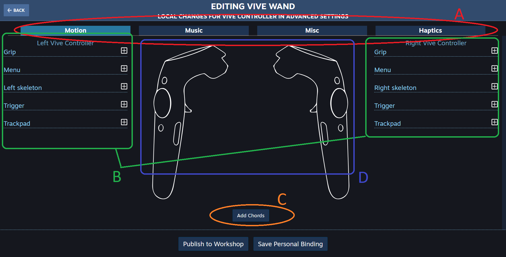

- A – Action sets. These tabs essentially let programmers have different keybinds for different scenarios. You may want different controls when you are driving a car versus running around. In Advanced Settings we simply use them as a grouping utility, and ALL action sets are active ALL the time. 
- B – Input options – your "buttons"
- C – Chords/Special Binds. More on these later.
- D – Controller Diagram, visually shows you the button location on a depiction of the controller

### My First Bind

In this example we are going to use the "grip" button on a vive wand to play the next song on a media player.

- First we click the [+] on the grip line to create an emtpy binding.

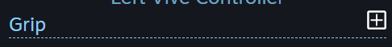

- We then select the behavior of the button.

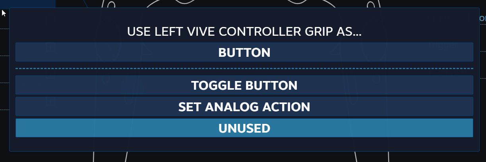

- Button – Action is active when button is pressed.
- Toggle Button – Action toggles state when button is pressed i.e. on until pressed again.
- Set Analog Action – Action that are not binary i.e. trigger is pressed 50%
- Select the "Button" option.

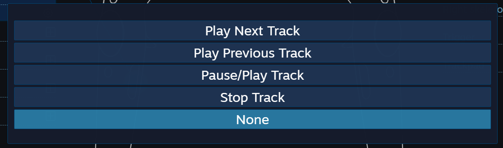

- In the next menu choose "Play Next Track".
- Now simply click the checkmark to save changes, and you should be good to go!

### Advanced Bindings

The guide above will satisfy the binding needs of 90% of people.
Below are described some behaviors that aren't strictly necessary for using the application, but could improve your experience.

- First we will start by editing an action, hover over a set action and click the pen.

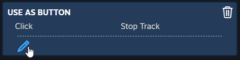

- Now you will notice two important things the "more options" and the cog.
- The Cog allows you to set up haptics for activating an action 

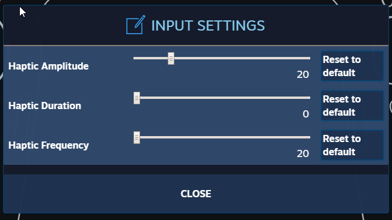

- Amplitude - How powerful the haptic will be, from 0 to 100 percent.
- Duration - How long the haptic will last, from 0 to 4 seconds.
- Frequency - The frequency/"feel" of the haptic.
- But what about the "more options?"

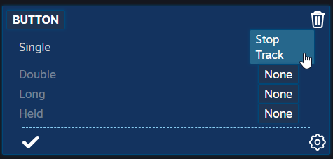

- Here you can bind different actions to the same button, but different activation methods.
- Single – Single click. The default.
- Double – Double click (about .25 seconds in between clicks max).
- Long Hold – Long hold ~1-2 seconds.
- Held – Action active when held.
- Touch – Active when the button is being touched (knuckles/ touch).
- And More – Analog inputs (triggers/joysticks/trackpads) have more options and configurations you can try out.

### Chord Bindings

**The Combo Maker!** Chords are just that, they allow you to combine a combination of keys to do an action for example a grip + trigger + trackpad Press.

**NOTE:** For you to be able to select a button in the chord menu you need to have clicked the [+] for the button and have an empty slot like below, and the behavior (toggle/button, etc.) must also be correct.

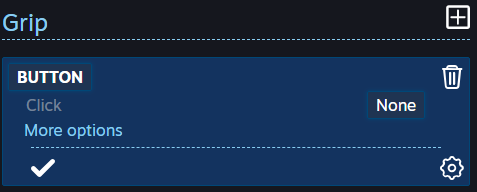

- Make sure you have empty bindings or a binding for all keys you will want to use in your chord, then click the "Add Chords" followed by "Add New Chord".
- You will be prompted for an action, select the result of your chord.
- You will now see the prototype for your chord and can add inputs as you desire

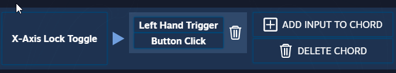

- And keep adding if you want to make sure you really don’t accidently press it!

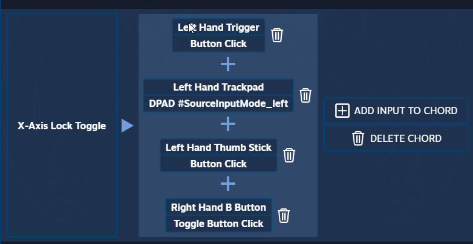

- That’s is it. Add more or close and you are done!

### Odds and Ends.... and Haptics!

- Haptics are a special action. It essentially tells the program which controller this haptic "action" belongs to.
- The add/edit Haptics button will be  next to the add/edit chord button. Find our app. (Haptics only exist in the "haptics" action set, as such you will want to set them.)
- **YOU MUST HAVE AN EMPTY BINDING**, otherwise haptics will not be bind-able. Anything will do, even "unused".


- Other than that just place the appropriate haptic action in the appropriate spot!

### Binding the System Button

- In order to be able to properly bind and use the System button you will need to do a few things.
  - Open the steamvr.vrsettings file with a text editor (default install location (win): C:\Program Files (x86)\Steam\config)
  - Add the Option `"sendSystemButtonToAllApps" : true` In the `steamvr` section
- Example

```
   "steamvr" : {
      "debugInputBinding" : true,
      "installID" : "123456789101112",
      "lastVersionNotice" : "1.5.14",
      "lastVersionNoticeDate" : "1561427586",
      "motionSmoothing" : false,
      "sendSystemButtonToAllApps" : true,
      "supersampleManualOverride" : true,
      "supersampleScale" : 1.7999999523162842
   },
```

**Note:** make sure you have it formatted exactly (commas after every item except last in list.)


### But wait it’s broke!

- We recommend a separate bind for every action. Multiple actions to one bind can cause un-predictable behavior.

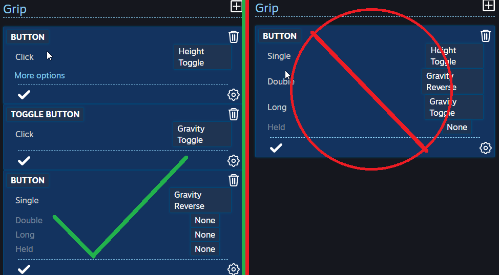

- This Guide Did not cover Legacy Applications or Simulated Actions, as the old input method is deprecated.
- We also include default bindings with our program, but it is impossible for us to include bindings for all controllers.


